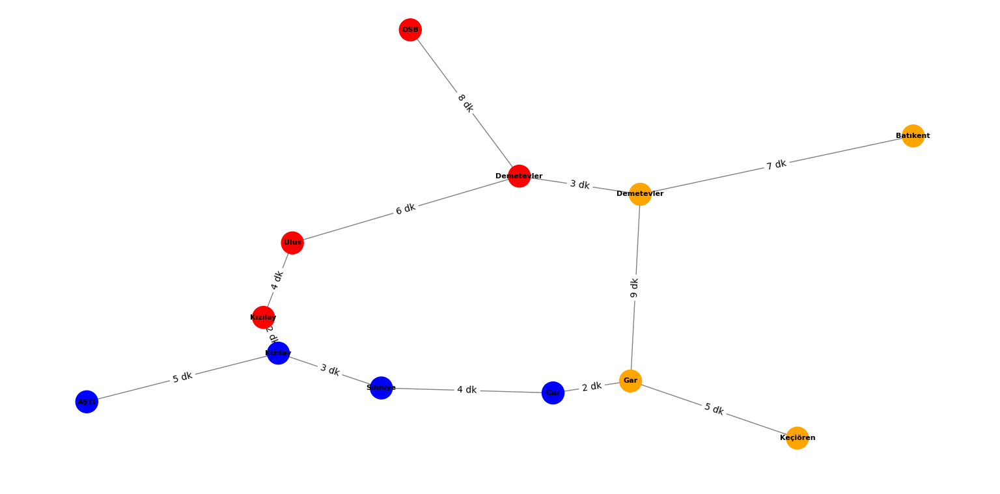
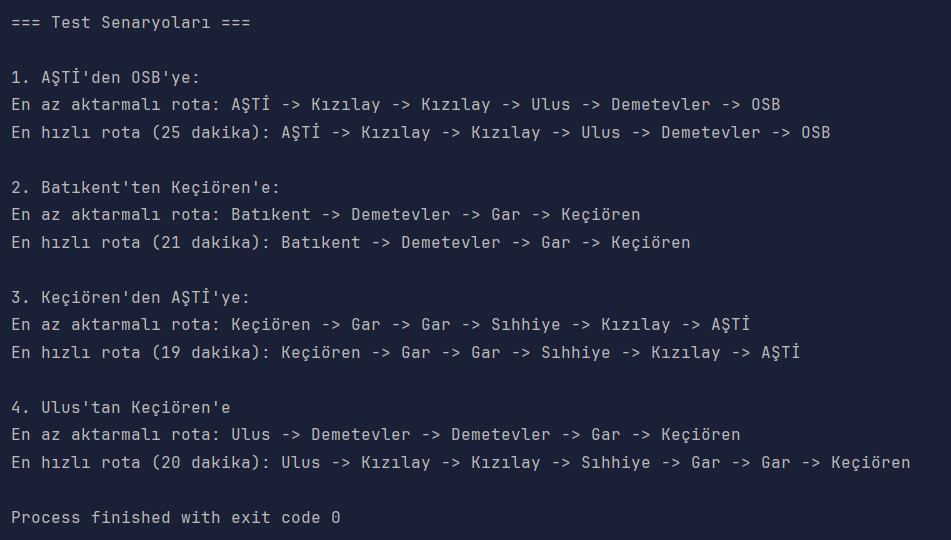

# METRO SİMULASYONU VE ROTA PLANLAMA

Bu proje, bir metro ağı üzerinde en az aktarmalı ve en hızlı rotaları bulur vebu metro ağını temsil eden bir graf yapısı oluşturur. Proje, kullanıcıların iki istasyon arasında en uygun rotayı bulmasına yardımcı olur. Ayrıca, metro ağını görselleştirerek harita üzerinde gösterir.

## KÜTÜPHANELER VE KULLANILAN TEKNOLOJİLER
```
- from collections - import defaultdict, deque
- import heapq
- from typing - import Dict, List, Set, Tuple, Optional
- import networkx - as nx
- import matplotlib.pyplot - as plt
```
## Kullanılan Kütüphaneler

[](https://networkx.org/)
[](https://matplotlib.org/)
[](https://docs.python.org/3/library/heapq.html)
[](https://docs.python.org/3/library/collections.html)
[](https://docs.python.org/3/library/typing.html)

`networkx`: Graf oluşturma, yönetme ve görselleştirme işlemleri için kullanıldı.

`matplotlib`: Grafın görselleştirilmesi ve haritanın çizilmesi için kullanıldı.

`heapq`: Dijkstra algoritmasında öncelikli kuyruk (priority queue) yapısını uygulamak için kullanıldı.

`collections`:

  * `defaultdict`: Hatların istasyon listelerini saklamak için kullanıldı.

  * `deque`: BFS algoritmasında kuyruk yapısını uygulamak için kullanıldı.

 `typing`: Python'da tür ipuçları (type hints) eklemek için kullanıldı.

## ALGORİTMALARIN ÇALIŞMA MANTIĞI

### BFS (Breadth-First Search) Algoritması:
Bu algoritma, **Breadth-First Search (BFS)** yöntemini kullanarak başlangıç istasyonundan hedef istasyonuna en az aktarmalı rotayı bulur. BFS, graf üzerinde genişliğine arama yapar ve hedefe en kısa adım sayısıyla ulaşır.

#### 🤔 Nasıl Çalışır❓:
1. **Başlangıç ve Hedef Kontrolü**: Eğer başlangıç veya hedef istasyonu metro ağında yoksa, `None` döner.
2. **Kuyruk Oluşturma**: Başlangıç istasyonu ve o ana kadar oluşturulan rota, bir kuyruğa (`deque`) eklenir.
3. **Ziyaret Edilenler**: Ziyaret edilen istasyonlar bir küme (`set`) içinde tutulur.
4. **Döngü**: Kuyruk boşalana kadar:
   - Kuyruktan bir istasyon ve rota çıkarılır.
   - Eğer bu istasyon hedef istasyon ise, rota döndürülür.
   - İstasyonun komşuları kontrol edilir. Eğer komşu daha önce ziyaret edilmemişse, kuyruğa eklenir.
5. **Sonuç**: Hedef bulunamazsa, `None` döner.

#### Örnek:
```
rota = metro.en_az_aktarma_bul("K1", "K4")
if rota:
    print("En az aktarmalı rota:", " -> ".join(i.ad for i in rota))
```
####  Neden Kullanıldı❓:
  * En az aktarmalı rotayı bulmak için idealdir çünkü BFS, hedefe en kısa adım sayısıyla ulaşır.


### A* Algoritması:
Bu algoritma, **A*** yöntemini kullanarak başlangıç istasyonundan hedef istasyonuna en hızlı rotayı bulur. A*, Dijkstra algoritmasının gelişmiş bir versiyonudur ve hedefe yönelik bir sezgisel fonksiyon (`heuristic`) kullanır.

#### 🤔 Nasıl Çalışır❓: 
1. **Başlangıç ve Hedef Kontrolü**: Eğer başlangıç veya hedef istasyonu metro ağında yoksa, `None` döner.
2. **Öncelikli Kuyruk Oluşturma**: Başlangıç istasyonu, toplam süre (0), ve rota bir öncelikli kuyruğa (`heapq`) eklenir.
3. **Ziyaret Edilenler**: Ziyaret edilen istasyonlar bir küme (`set`) içinde tutulur.
4. **Döngü**: Öncelikli kuyruk boşalana kadar:
   - Kuyruktan en düşük toplam süreye sahip istasyon çıkarılır.
   - Eğer bu istasyon hedef istasyon ise, rota ve toplam süre döndürülür.
   - İstasyonun komşuları kontrol edilir. Eğer komşu daha önce ziyaret edilmemişse, yeni rota ve toplam süre hesaplanarak kuyruğa eklenir.
5. **Sonuç**: Hedef bulunamazsa, `None` döner.

### Örnek:

`sonuc = metro.en_hizli_rota_bul("K1", "K4")
if sonuc:
    rota, sure = sonuc
    print(f"En hızlı rota ({sure} dakika):", " -> ".join(i.ad for i in rota))`

 #### Neden Kullanıldı❓:
  * En iyi çözümü garanti eder (eğer sezgisel fonksiyon doğruysa).
    
  * Özellikle büyük ölçekli graf yapılarında daha verimlidir.


## ÖRNEK KULLANIM VE TEST SONUÇLARI

## Metro ağı oluştur
```
metro = MetroAgi()
```
## İstasyonlar ekle
```
metro.istasyon_ekle("K1", "Kızılay", "Kırmızı Hat")
metro.istasyon_ekle("K2", "Ulus", "Kırmızı Hat")
metro.istasyon_ekle("K3", "Demetevler", "Kırmızı Hat")
metro.istasyon_ekle("K4", "OSB", "Kırmızı Hat")


metro.istasyon_ekle("M1", "AŞTİ", "Mavi Hat")
metro.istasyon_ekle("M2", "Kızılay", "Mavi Hat")  # Aktarma noktası
metro.istasyon_ekle("M3", "Sıhhiye", "Mavi Hat")
metro.istasyon_ekle("M4", "Gar", "Mavi Hat")

metro.istasyon_ekle("T1", "Batıkent", "Turuncu Hat")
metro.istasyon_ekle("T2", "Demetevler", "Turuncu Hat")  # Aktarma noktası
metro.istasyon_ekle("T3", "Gar", "Turuncu Hat")  # Aktarma noktası
metro.istasyon_ekle("T4", "Keçiören", "Turuncu Hat")
```
## Bağlantılar ekle
```
metro.baglanti_ekle("K1", "K2", 4)  # Kızılay -> Ulus (4 dakika)
metro.baglanti_ekle("K2", "K3", 6)  # Ulus -> Demetevler (6 dakika)
metro.baglanti_ekle("K3", "K4", 8)  # Demetevler -> OSB (8 dakika)

metro.baglanti_ekle("M1", "M2", 5)  # AŞTİ -> Kızılay
metro.baglanti_ekle("M2", "M3", 3)  # Kızılay -> Sıhhiye
metro.baglanti_ekle("M3", "M4", 4)  # Sıhhiye -> Gar

metro.baglanti_ekle("T1", "T2", 7)  # Batıkent -> Demetevler
metro.baglanti_ekle("T2", "T3", 9)  # Demetevler -> Gar
metro.baglanti_ekle("T3", "T4", 5)  # Gar -> Keçiören
```
### Hat aktarma bağlantıları (aynı istasyon farklı hatlar)
```
metro.baglanti_ekle("K1", "M2", 2)  # Kızılay aktarma (2 dakika)
metro.baglanti_ekle("K3", "T2", 3)  # Demetevler aktarma (3 dakika)
metro.baglanti_ekle("M4", "T3", 2)  # Gar aktarma (2 dakika)
```
## TEST SENARYOLARI

### Örnek Senaryo: AŞTİ'den OSB'ye
```
print("\n1. AŞTİ'den OSB'ye:")
rota = metro.en_az_aktarma_bul("M1", "K4")
if rota:
    print("En az aktarmalı rota:", " -> ".join(i.ad for i in rota))

sonuc = metro.en_hizli_rota_bul("M1", "K4")
if sonuc:
    rota, sure = sonuc
    print(f"En hızlı rota ({sure} dakika):", " -> ".join(i.ad for i in rota))
```
### METRO HARİTASI GRAFİĞİ OLUŞTURMA
```
def metro_map(metro: MetroAgi):

    G = nx.Graph()

    for istasyon_id, istasyon in metro.istasyonlar.items():
        G.add_node(istasyon_id, ad=istasyon.ad, hat=istasyon.hat)

        for komsu, sure in istasyon.komsular:
            G.add_edge(istasyon_id, komsu.idx, weight=sure)


    position = nx.kamada_kawai_layout(G)

    hat_renkleri = {
        "Kırmızı Hat": "red",
        "Mavi Hat": "blue",
        "Turuncu Hat": "orange"}

    labels = {node: metro.istasyonlar[node].ad for node in G.nodes()}
    renkler = [hat_renkleri[metro.istasyonlar[node].hat] for node in G.nodes()]

    plt.figure(figsize=(12, 8))
    nx.draw(G, position, with_labels=True, labels=labels, node_color=renkler, node_size=600, font_size=8, font_weight='bold', edge_color='gray')
    edge_labels = nx.get_edge_attributes(G, 'weight')
    for k in edge_labels:
        edge_labels[k] = f"{edge_labels[k]} dk"

    nx.draw_networkx_edge_labels(G, position, edge_labels=edge_labels)
    plt.title("Metro Haritası")
    plt.show()
metro_map(metro)
```
## OUTPUTS



## PROJE GELİŞTİRME FİKİRLERİ
1. Sezgisel Fonksiyon İyileştirmeleri <br>
A* algoritmasında kullanılan sezgisel fonksiyon (h(n)) daha hassas hale getirilebilir. Örneğin, istasyonlar arasındaki fiziksel mesafe veya trafik yoğunluğu dikkate alınabilir.
2. Gerçek Zamanlı Veri Entegrasyonu <br>
Metro istasyonlarının gerçek zamanlı verilerini (örneğin, trenlerin konumu, gecikmeler) entegre ederek daha dinamik bir rota planlama sistemi oluşturulabilir.
3. Kullanıcı Arayüzü <br> 
Graf arayüzü yerine, kullanıcıların istasyonları seçebileceği ve rotaları görebileceği bir web veya mobil uygulama geliştirilebilir.
4. Çoklu Ulaşım Modları <br> 
Metro haritasına otobüs, tramvay gibi diğer ulaşım modları eklenerek daha kapsamlı bir rota planlama sistemi oluşturulabilir.
5. Optimizasyonlar <br> 
Büyük ölçekli metro ağları için veri yapıları ve algoritmalar optimize edilebilir.
6. Görselleştirme İyileştirmeleri <br> 
Harita üzerinde istasyonların hatlarını daha belirgin hale getirmek için renkler ve etiketler iyileştirilebilir.


